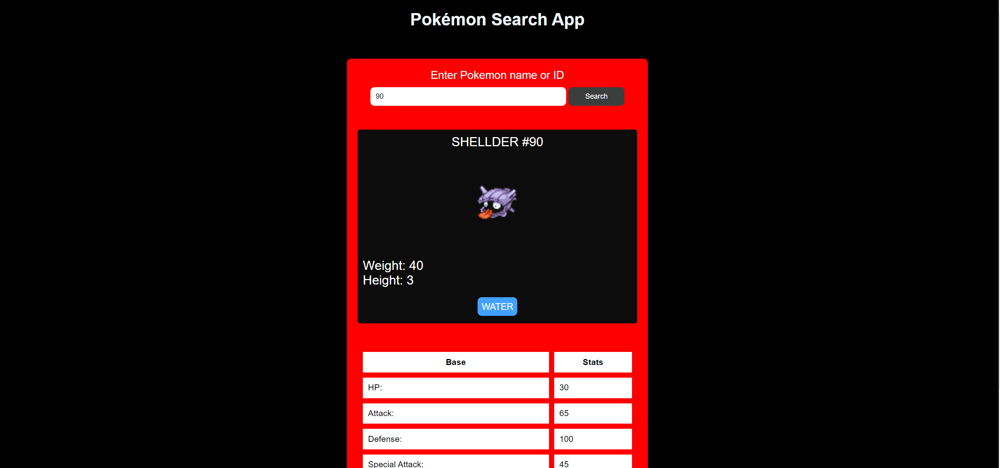

# Pokemon-Search-App 🚀

## Project Description 📝

>
A web application for searching Pokémon details by name or ID using the PokéAPI Proxy provided by freeCodeCamp.
include these functionalities:

- Search: Enter a Pokémon name or ID to retrieve detailed information.
- Display: Show Pokémon name, ID, weight, height, types, and stats (HP, Attack, Defense, Special Attack, Special Defense, Speed).
- Sprite: Display the Pokémon's sprite image.
- Responsive: Designed to work seamlessly on desktop and mobile devices.
- This project is based on the FreeCodeCamp Cash Register project and serves as a simplified implementation.
>

## Demo 📸

life demo link [(https://farwamuhibzada.github.io/Cash_Register_App/)]





## Technologies Used 🛠️

List the technologies or tools that i used to develop this project. 
- HTML
- CSS
- java script
- Fetch API


## Installation 💻

for using this project you neet to install 3 things:

- chrombrowser
- an IDE like vscode
- git
- node JS


## Usage 🎯

for using this project you need to know a few commond first clone the repositry in yor local machine then go to the github directory . open the project on your IDE like vscode and start working on it .


go to the cmd and clone the Technical Documentation Page 
using this commond:
```bash

git clone https://github.com/FarwaMuhibZada/Pokemon-Search-App/.git 
```
go to the githu directory:
```bash

cd>Pokemon-Search-App

```
open the project on your IDE like vscode :

```bash

cd> code .

```


## Features ⭐
- take an inpute from user
- check the entered number
- has multipal conditions
- convert any number into Roman number
- give an output as result 
- return a alert box if there is an empty value 


## FarwaMuhibzada 👩‍💻


- LinkedIn: [(https://www.linkedin.com/in/farwa-muhibzada/)]
- Email: [(farwafarid2017@gmail.com)]

## Contributing 🤝
For contribution you can create a pull request and mention me there.Thank you.